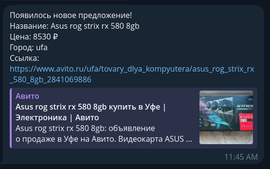

# AvitoOffersNotifier
Telegram bot which helps you to track avito.ru for new offers. Currently, the bot is offline, but you can host it in your own. Example of notifications from telegram bot:


## Dependencies
To host by yourself, you need to have linux server with Python 3.11.5 and PostgreSQL installed.

## Installation and run
First, clone the repository to your machine where you want host the telegram bot and go the project directory:
``` bash
git clone https://github.com/jakefish18/AvitoOffersNotifier
cd AvitoOffersNotifier
```

Second, it is not a required step, but I highly recommend to create `venv/` for the project
```bash
python3 -m venv venv/
source venv/bin/activate
```
In case you have fish shell:
```bash
python3 -m venv venv/
source venv/bin/activate.fish
```

Third, install the requirements
``` bash
pip3 install -r requirements.txt 
```

Fourth, create a `.env` file in `src` folder and fill it using `.env.example` as an example:
``` bash
# Bot config.
BOT_TOKEN = ""
BOT_LOGS_FILEPATH = "" # Path to some 'bot.log' file.

# Proxy config.
# Do not change if no proxy.
PROXY_HTTP = ""
PROXY_HTTPS = ""
PROXY_CHANGE_URL = ""

# Database config.
DATABASE_HOST = "127.0.0.1"
DATABASE_NAME = ""
DATABASE_USERNAME = ""
DATABASE_PASSWORD = ""
PATH_TO_SQL_QUERIES = "" # Specity the full path to the /sql_queries/ folder with / at the end.

# Parser config.
CLIENT_NOTIFIER_LOGS = ""
```
As you can see, you need to get the bot token from BotFather and create a postgresql database. Also, create and specify the full paths to the `.log` files.  

Last, run the bot:
```bash
cd code
python3 main.py
```

## Fun fact
This project was made for the Big Challenges comptetition in 2023 year. [Here](https://docs.google.com/presentation/d/10CkyUNXqG9_ptOFSJSeptTL8Wr47slV_0ZzA-ocSR-4/edit#slide=id.g2083945dfbb_0_25) you can find the presentation of it.